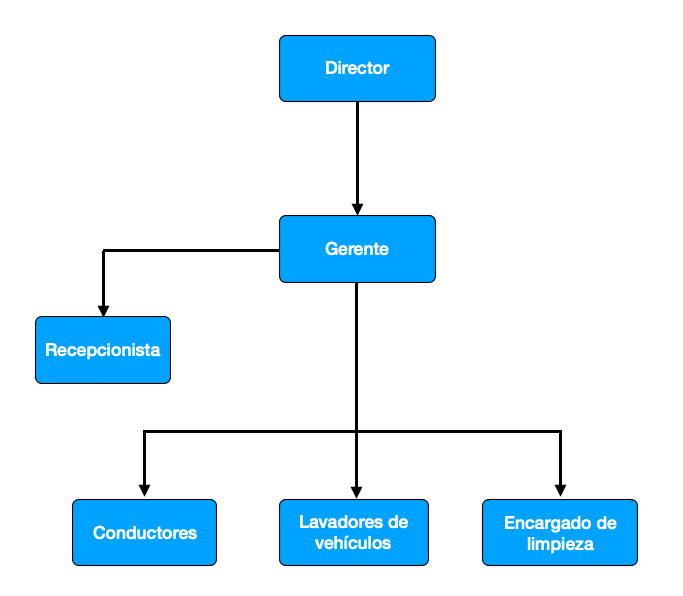

# Trabajo final

## Descripción y naturaleza de la empresa
____ es una empresa privada de alquiler de vehículos fundada en el año 2021, ofrecemos tarifas de alquiler económicas, así como una experiencia de servicio al cliente agradable y sin complicaciones, contamos con una amplia gama de vehículos para satisfacer tus necesidades, ya que contamos con el respaldo de los principales grupos automovilísticos del país.

En ____ atendemos las necesidades de viajeros de placer tanto extranjeros como locales que desean alquilar un vehículo con una oferta de excelente relación precio calidad. Nuestro personal está altamente capacitado y tiene como objetivo brindar un servicio extraordinario en nuestro Centro de Contacto.
 
 
## Misión, Visión, valores y objetivos de la empresa

__Misión:__ nuestra misión es ofrecer un servicio de calidad, de bajo costo, y proveer un experiencia inolvidable a nuestros clientes.

__Visión:__ ser la primera opción para la renta de vehículos en Santo Domingo

__Valores:__ nuestros valores son la piedra angular de nuestro negocio. Estos principios guían nuestra manera de hacer negocios, las relaciones con nuestros asociados y accionistas, las inversiones que realizamos y nuestros planes a futuro. Estos valores son: 
* Profesionalismo
* Pasión
* Respeto
* Responsabilidad
* Integridad
* Innovación
* Diversidad
* Disciplina
* Exelencia

__Objetivos de la empresa:__ 
Ser la mejor opción a la hora de rentar un vehículo, menor costo y mejor calidad.
Ofrecer una experiencia inigualable y satisfactoria.
Posicionarnos como la primera opción para rentar un vehículo, tanto para extranjeros como para residentes.
 
 
## Organigrama de la empresa

 
 

## Modelo de datos (no esta terminado)
